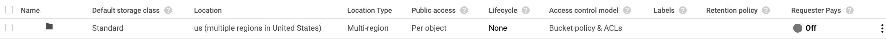

# Speech to Text Instruction

## files names:
1. large_audio.py (code file)
2. ***.json (generate credential key file)
5. input folder (has all input audio in it)
    1. ***.wav (the audio file for convert)
4. output folder (has all output json file)
    1. ***.json (output json file which has same name as your audio file)
5. bucket-example.png (example bucket picture)

***
## pre-steps:

##### create google cloud account, create google api project 

1. Create a Google cloud account.
2. Click on “Select a project” to create a project in Google Cloud. Click on “New project” and provide a name.
3. Type “Cloud Speech API” on the project search page. We need to enable this API to use the Speech to Text API service. In addition, need to provide credit/debit card or bank account details to use the free API service. There is no auto charge after the free trial ends. So please provide all the details and enable the API. There are limitations in the free trial use which is provided in the Google speech API documentation.

##### create credential

1. Sign-in to Google Cloud Console (Page here : [Cloud Speech-to-Text - Speech Recognition  \|  Cloud Speech-to-Text  |  Google Cloud](https://cloud.google.com/speech-to-text/))
6. Click “APIs & Services”
7. Click “Credentials”
8. Click “Create Credentials”
9. Select “Service Account Key”
10. Under “Service Account” select “New service account”
11. Name service (whatever you’d like)
12. Select Role: “Project” -> “Owner”
13. Leave “JSON” option selected
14. Click “Create”
15. Save generated API key file
16. Rename file to api-key.json
17. note: make sure the key.json file is at same directory with your large_audio.py file

##### create bucket
1. Once you create the API client, the next step is to create a storage bucket.
2. use this link to create bucket :  [Google Cloud Platform](https://console.cloud.google.com/storage/?source=post_page-----1c886f4eb3e9----------------------)
3. the bucket you created should have same type and setting as the picture below
4. 

***
## requirements:
1. audio file have to be .wav file
2. don't need to be mono audio

***
## steps:

##### 1. change initial setting

1. filepath : Input audio file path
2. output_filepath : after run the code, output trancript will be in this file
3. os.environ["GOOGLE_APPLICATION_CREDENTIALS"] =  : After register for the google cloud and get the credential, you will have a .json file. Set this command to that .json file and it will give you approval to use google cloud api. 
note: .json file have to be 
  
 
##### 2. put all of the audio files into "filepath" at initial setting

